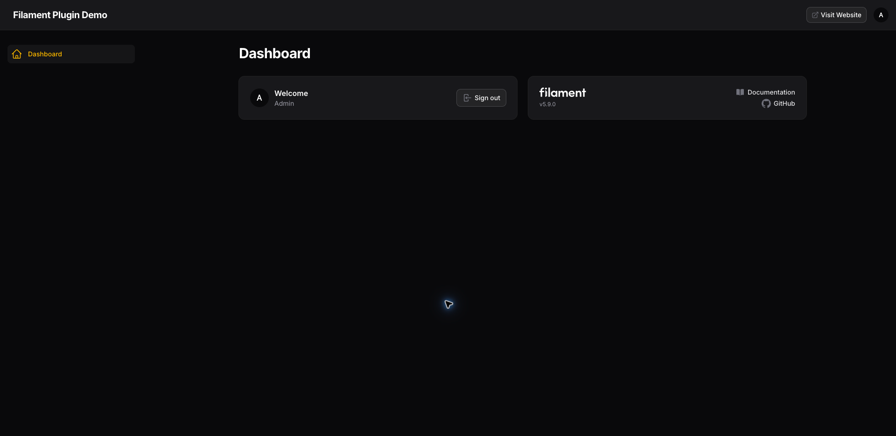
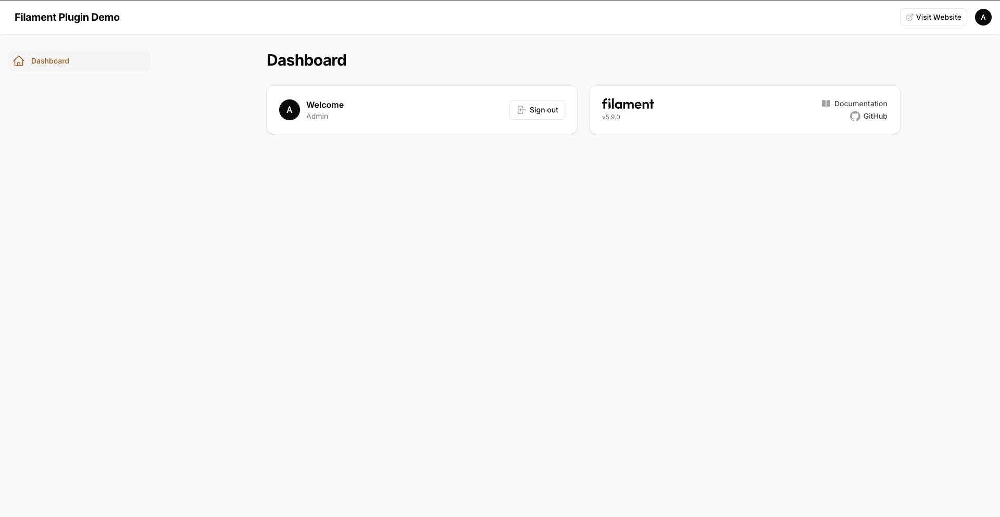
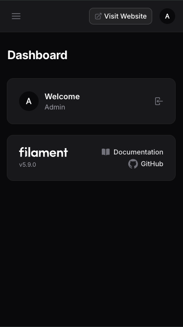

# Filament View Website

A lightweight Filament 5 panel plugin that adds a configurable “Visit Website” action to the panel topbar.

It provides a quick link from a Filament admin panel to the public website using native Filament UI. The URL, label, icon, tooltip, visibility, and new-tab behavior are configurable. The plugin requires no database tables, migrations, JavaScript, CSS, or frontend assets.

Source repository: [Digit7s/filament-view-website](https://github.com/Digit7s/filament-view-website)

[](https://packagist.org/packages/digit7s/filament-view-website)
[](https://packagist.org/packages/digit7s/filament-view-website)
[](https://github.com/Digit7s/filament-view-website/blob/main/LICENSE.md)

## Screenshot



## Features

- Native Filament topbar integration
- Zero-configuration defaults
- Static or dynamic URL
- Custom label and icon
- Optional tooltip
- Same-tab or new-tab navigation
- Conditional visibility
- No database tables or migrations
- No custom CSS or JavaScript
- Filament 5 support

## Requirements

- PHP `^8.2`
- Filament `^5.0`

Laravel and Livewire compatibility follows Filament 5.

## Installation

Install the package via Composer:

```bash
composer require digit7s/filament-view-website
```

Laravel package discovery registers the service provider automatically.

## Usage

Register the plugin on each panel where the action should appear:

```php
use Digit7s\FilamentViewWebsite\ViewWebsitePlugin;
use Filament\Panel;

public function panel(Panel $panel): Panel
{
    return $panel
        // ...
        ->plugin(
            ViewWebsitePlugin::make()
        );
}
```

With no configuration, the plugin:

- links to the Laravel application root (`url('/')`);
- displays `Visit Website`;
- uses the `heroicon-o-arrow-top-right-on-square` icon;
- opens the website in a new tab; and
- appears before the Filament user menu.

## Configuration

### Custom URL

Configure a static URL:

```php
use Digit7s\FilamentViewWebsite\ViewWebsitePlugin;

ViewWebsitePlugin::make()
    ->url('https://example.com');
```

### Dynamic URL

The URL may be provided as a closure:

```php
ViewWebsitePlugin::make()
    ->url(fn (): string => config('app.frontend_url'));
```

Laravel helpers can also be used:

```php
ViewWebsitePlugin::make()
    ->url(fn (): string => route('home'));
```

### Custom Label

```php
ViewWebsitePlugin::make()
    ->label('Open Website');
```

### Custom Icon

```php
ViewWebsitePlugin::make()
    ->icon('heroicon-o-globe-alt');
```

### Tooltip

Set a custom tooltip:

```php
ViewWebsitePlugin::make()
    ->tooltip('Open public website');
```

Disable the tooltip with `->tooltip(null)`.

### Open in Same Tab

New-tab navigation is enabled by default. To open the website in the current tab:

```php
ViewWebsitePlugin::make()
    ->openInNewTab(false);
```

### Conditional Visibility

Use a boolean or closure to control whether the action is rendered:

```php
ViewWebsitePlugin::make()
    ->visible(
        fn (): bool => auth()->user()?->can('view website') ?? false
    );
```

The package does not provide its own permission system; this only controls conditional rendering.

### Complete Example

```php
ViewWebsitePlugin::make()
    ->url('https://example.com')
    ->label('Visit Website')
    ->icon('heroicon-o-arrow-top-right-on-square')
    ->tooltip('Open public website')
    ->openInNewTab()
    ->visible(fn (): bool => true);
```

## Defaults

| Option | Default |
| --- | --- |
| URL | Application root (`url('/')`) |
| Label | `Visit Website` |
| Icon | `heroicon-o-arrow-top-right-on-square` |
| Tooltip | `Open public website` |
| New tab | Enabled |
| Visible | Yes |
| Position | Before the user menu |

If the resolved URL is blank, the action is not rendered.

The plugin uses native Filament components, so it follows the panel's styling and dark mode. No custom CSS or JavaScript is required.

## Screenshots

The same integration is also available in light mode and on narrow screens:





## Testing

Run the package checks from the repository directory:

```bash
composer test
composer lint
composer test:lint
composer analyse
composer validate --no-check-publish
```

## Security

Please do not report security vulnerabilities through public GitHub issues. See [SECURITY.md](SECURITY.md) for reporting instructions.

## Changelog

See [CHANGELOG.md](CHANGELOG.md) for release history.

## Contributing

Contributions are welcome. Please open an issue or pull request on [GitHub](https://github.com/Digit7s/filament-view-website).

## Credits

- Myo Min Oo
- [Digit7s](https://github.com/Digit7s)

## License

The MIT License (MIT). Please see [LICENSE.md](LICENSE.md) for more information.
